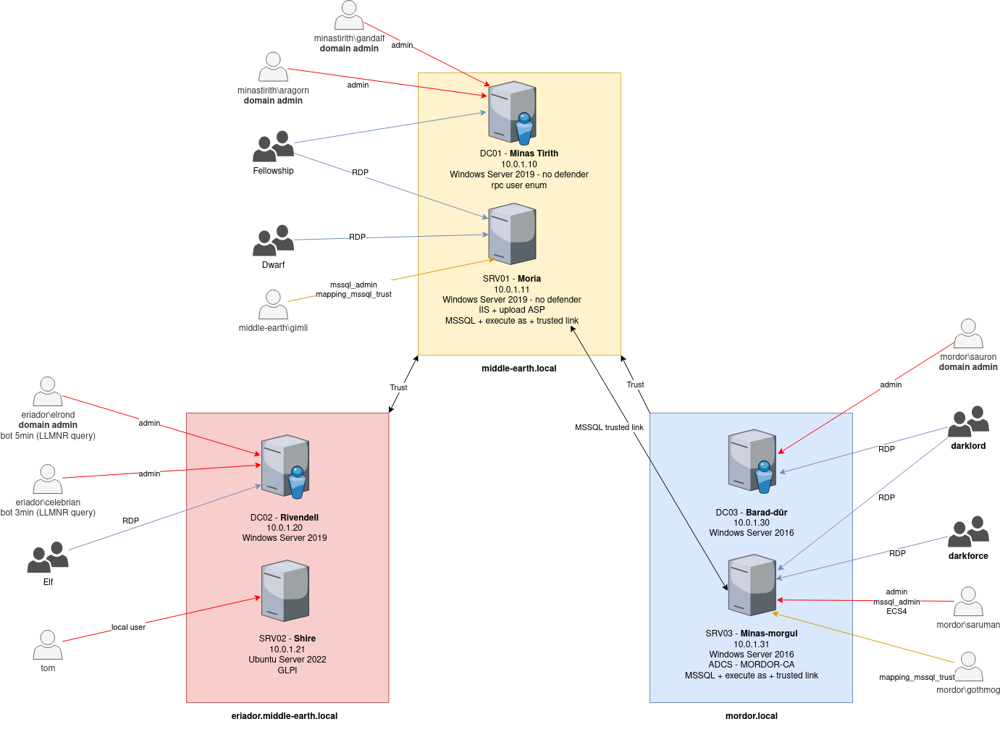

# Intro
Based on AWS-Redteam-Lab and OCD GOAD

The price for running the lab for 125 hours during one month is approximately 14$.
With Free Tier you get 750h of EC2 per month, there is 6 machines so 125h. But you only get 30Gb of storage. So you need storage for the other 5 VMs : 30Gb * 5 = 150Gb = 14$ / month

# Installation

Just like the GOAD project, the installation is in two part :

- providing : it is made with terraform, it configures your AWS VPC, network, and EC2 (virtual machines)
- provisioning : it is made with ansible, it will install all the stuff to make the lab running like an active directory network

# Provisioning

## Requirements

So far the lab has only been tested on a linux machine, but it should work as well on macOS. Ansible has some problems with Windows hosts so I don't know about that.

For the setup to work properly you need to install:

## Ansible

### Ansible with docker
If you want to do the provisioning from a docker container you could launch the following command to prepare the container
```
sudo docker build -t loadansible .
```

### Ansible on your host

If you want to play ansible from your host you should launch the following commands :
1) Create a python >= 3.8 virtualenv
```bash
sudo apt install git
git clone git@github.com:0xBallpoint/LOAD.git
cd LOAD/ansible
sudo apt install python3.8-venv
python3.8 -m virtualenv .venv
source .venv/bin/activate
```

2) Install `ansible` and `pywinrm` in the .venv
    - ansible following the extensive guide on their website [ansible](https://docs.ansible.com/ansible/latest/installation_guide/intro_installation.html).
    - Tested with ansible-core (2.12)
    -  pywinrm be sure you got the pywinrm package installed
```
python3 -m pip install --upgrade pip
python3 -m pip install ansible-core==2.12.6
python3 -m pip install pywinrm
```

3) Install all the ansible-galaxy requirements
    - ansible windows
    - ansible community.windows
    - ansible community.general
```bash
ansible-galaxy install -r requirements.yml
```

## Terraform

You need to install Terraform following their guide on their website [hashicorp.com](https://developer.hashicorp.com/terraform/tutorials/aws-get-started/install-cli)

If you want to manually install Terraform on Linux :
```
sudo apt-get update && sudo apt-get install -y gnupg software-properties-common

# Install the HasiCorp GPG key
wget -O- https://apt.releases.hashicorp.com/gpg | \
    gpg --dearmor | \
    sudo tee /usr/share/keyrings/hashicorp-archive-keyring.gpg

# Verify the key's fingerprint
gpg --no-default-keyring \
    --keyring /usr/share/keyrings/hashicorp-archive-keyring.gpg \
    --fingerprint
# It must match E8A0 32E0 94D8 EB4E A189 D270 DA41 8C88 A321 9F7B (from https://www.hashicorp.com/security)

# Add the official HashiCorp repository to your system
echo "deb [signed-by=/usr/share/keyrings/hashicorp-archive-keyring.gpg] \
    https://apt.releases.hashicorp.com $(lsb_release -cs) main" | \
    sudo tee /etc/apt/sources.list.d/hashicorp.list

# Update, install, verify
sudo apt update
sudo apt install terraform
terraform -help
```

### AWS CLI
You will need the AWS CLI to configure your access keys to AWS. You should follow the install guide on their website [docs.aws.amazon.com](https://docs.aws.amazon.com/cli/latest/userguide/getting-started-install.html)

For Linux :
```
curl "https://awscli.amazonaws.com/awscli-exe-linux-x86_64.zip" -o "awscliv2.zip"
unzip awscliv2.zip
sudo ./aws/install
```

# Start / Setup

The default domain will be middle-earth.local, on the subnet 10.0.1.0/24 and each machine has only been allocated with 1CPU and 1024MB of memory (t2.micro). If you want to change some of these performance settings you can modify the file : `terraform/ami-instance.tf`

To have the lab up and running this is the commands you should do:

## VMs creation
```bash
pwd
/opt/LOAD  # place yourself in the LOAD folder (where you cloned the project)
cd terraform # start with AWS configuration
```
The next steps show you how to configure your VMs on AWS:
1. Copy the `var.tf.example` to `var.tf` and change values :
    - REGION : change according to your favorite region
    - MANAGEMENT_IPS : add your IPv4 addresses that can access your lab

2. On your AWS console, you should create a terraform user and get your AWS keys:
    - Go to https://us-east-1.console.aws.amazon.com/iamv2/home#/users
    - In user name : `terraform`
    - Select AWS credential type : `Access key - Programmatic access`
    - Add the permissions you want
    - Create user
    - Copy `Access key ID` and `Secret access key`

3. Add the keys on your machine with AWS CLI:
```bash
aws configure --profile terraform
    AWS Access Key ID [None]: <access_key_id>
    AWS Secret Access Key [None]: <secret_access_key>
```

4. Create SSH keys for terraform:
```bash
cd LOAD
ssh-keygen -t rsa -N "" -b 2048 -C "TerraformKey" -f ./terraform/keys/TerraformKey
```

4. Run Terraform
```bash
terraform apply
```

If you want to destroy your lab : 
```bash
terraform destroy
```

## VMs provisioning

Everytime your EC2 instances start, you have to change their public IP in the `ansible/hosts` file. Add the output of this command at the end of the file : 
```bash
aws ec2 describe-instances --profile terraform --region eu-central-1 --query "Reservations[*].Instances[*].{Name:Tags[?Key=='Name'].Value|[],PublicIP:PublicIpAddress}" --filters "Name=instance-state-name,Values=running" --output text |tac |awk 'NR%2 ==0 {print $0}; NR%2 != 0 {print "["tolower(substr($2,5))"]"};'
```

To configure the VMs use the command `ansible-playbook`. Usual time to run : 1h30
```bash
ansible-playbook main.yml # this will configure the vms in order to play ansible when the vms are ready
```

To run the provisioning from the docker container run (you should be in the same folder as the Dockerfile. Not tested yet):
```
sudo docker run -ti --rm --network host -h loadansible -v $(pwd):/load -w /load/ansible loadansible ansible-playbook main.yml
```

Sometimes an error can occur during the install. Most of the times, you can just run the playbook again and it should work. 
In order to run playbooks one by one :
```bash
# The main.yml playbook is build in multiples parts. each parts can be re-run independently but the play order must be keep in cas you want to play one by one :

ansible-playbook prepare.yml         # updates, passwords, dns settings...
ansible-playbook ad-servers.yml      # create servers configuration
ansible-playbook ad-trusts.yml       # create the trust relationships
ansible-playbook ad-data.yml         # import the ad datas : users/groups...
ansible-playbook ad-groups.yml       # set the rights and the group domains relations
ansible-playbook servers.yml         # create IIS and MSSQL
ansible-playbook adcs.yml            # add adcs and adcs templates
ansible-playbook ad-acl.yml          # set ACL
ansible-playbook linux.yml           # configure linux entrypoint with GLPI

ansible-playbook security.yml        # enable or disable windows defender here
ansible-playbook vulnerabilities.yml # specifics vulns linked to the scenario are here

# You can also install wireguard VPN on the linux host, for that check the VPN paragraph
```

If you want to play only a specific part of a playbook, you can use tags (always put `data` as a tag):
```
ansible-playbook servers.yml
ansible-playbook servers.yml --tags data,iis
ansible-playbook linux.yml --tags data,glpi
```

# AWS CLI
Some commands to help you manage your AWS lab (it's ugly but it works):
```bash
# aws cli profile : terraform
# region : eu-central-1 

# Disable instance metadata
for i in $(aws ec2 --profile terraform --region eu-central-1 describe-instances --filters "Name=tag:Name,Values=lab-*" --query 'Reservations[].Instances[].InstanceId' |cut -d '"' -f2); do aws ec2 --profile terraform --region eu-central-1 modify-instance-metadata-options --http-endpoint disabled --instance-id $i --output json --no-cli-pager;done

# Start instances
aws ec2 --profile terraform --region eu-central-1 start-instances --instance-ids `aws ec2 --profile terraform --region eu-central-1 describe-instances --filters "Name=tag:Name,Values=lab-*" "Name=instance-state-name,Values=stopping,stopped" --query 'Reservations[].Instances[].InstanceId' --output text`

# Get running instance and output it to ansible format
aws ec2 describe-instances --profile terraform --region eu-central-1 --query "Reservations[*].Instances[*].{Name:Tags[?Key=='Name'].Value|[],PublicIP:PublicIpAddress}" --filters "Name=instance-state-name,Values=running" --output text |tac |awk 'NR%2 ==0 {print $0}; NR%2 != 0 {print "["tolower(substr($2,5))"]"};'
```


# VPN Server

Optionally, you can add a VPN server on the Linux host, and configure as many clients as you want. 
Start by generating keys for the VPN server and change the number of clients:
```bash
apt install wireguard

# generate wireguard keys
privkey=$(wg genkey) sh -c 'echo "
    server_privkey: $privkey
    server_pubkey: $(echo $privkey | wg pubkey)"'

# encrypt server_privkey with ansible-vault and 
ansible-vault encrypt_string --ask-vault-password --stdin-name server_privkey

# Add the result to group_vars/all.yml
# You can change the number of client configuration files it will create. By default it creates 6 clients.
```

Run the VPN playbook with this command (it will change the clients keys everytime you run the command):
```bash
ansible-playbook --ask-vault-password vpn.yml
```
If you get this error `Timeout (12s) waiting for privilege escalation prompt`, just run the command again.

You will find you client configuration file in `ansible/wireguard/lab_client[0-9].conf`. 

To connect to the VPN, you need to copy the client files with the private key to your local host in `/etc/wireguard/`.

You start the VPN connexion for the first client with :
```bash
sudo wg-quick up lab_client1
```
You will get an IP in 10.0.20.0/24


# Vulnerabilities



## LINUX
```
SHIRE (srv02)
    - GLPI SQLi
    - GLPI-htmlawed-CVE-2022-35914

USERS
    - privesc user with vulnerable crontab
    - privesc root with password in bash_history and sudo nopasswd for /bin/systemctl
```

## ERIADOR.MIDDLE-EARTH.LOCAL
```
RIVENDELL (dc02)
    - anonymous RPC (enum users, pass pol, groups / rpcclient)
    - brute force users names

ELF
    - celebrian    Responder crack hash (bot 3min)
    - elrond:      Responder with NTLM relay domain admin (bot 5min)

HOBBIT
    - bilbo:       password in description
    - pippin:      ASREPROAST 
    - merry:       Constrained delegation with protocol transition / Kerberoasting
    - froddo:
    - sam:
```

## MIDDLE-EARTH.LOCAL
```
MINAS-TIRITH(dc01)
    - Open share RW, LNK exploit
    - khamul.easterling : Open backup share, with GPO with cpassword, password increment

MORIA (srv01)
    - MSSQL trusted link : donPapi to get sql_svc password
    - mitm6 SRV01 -> DC01

MEN
    - denethor:    DOMAIN ADMIN
    - theoden:     ACL self-self-membership-on-group DOMAIN ADMIN
    - faramir:     ACL genericwrite-on-user Denethor
    - boromir:     ACL genericall-on-user Denethor
                   ACL forcechangepassword on Faramir 
                   WriteDACL MEN 

FELLOWSHIP
    - legolas:     execute as user on MSSQL
                   KERBEROASTING 
    - gimli:       ACL genericall-on-computer MORIA
                   ACL writeproperty-self-membership DOMAIN ADMIN
    - aragorn:     execute as login on mssql / administrator
    - gandalf:     mssql admin
                   group cross domain
                   mssql trusted link
                   ACL writeproperty-self-membership Domain Admins #TODO change for someone who is not administrator, he has DCSYNC (administrator?)

ENTS
    - treebeard:   ACL writeproperty-on-group DOMAIN ADMIN
    - skinbark:    ACL genericall-on-group DOMAIN ADMIN
    - ginglas:     ACL write owner on group DOMAIN ADMIN
```

## MORDOR.LOCAL
### Computers
```
BARAD-DUR (dc03)
    - Coerced DC + ntlmrelayx to ldaps
    - ADCS ESC1, ESC2, ESC3, ESC4, ESC8
    - NTLM downgrade attack

MINAS-MORGL (srv03)
    - IIS upload webshell
    - Privilege escalation Windows 2016 : SeImpersontePrivilege

DARKFORCE
    - sauron:     domain admin MORDOR
    - saruman:    mssql admin / GenericAll on gothmog (shadow credentials) / GenericAll on ECS4
    - balrog:

PRISONER
    - gollum:     mssql trusted link
                  password spray -> user=pwd
ORC
    - gothmog:    DOMAIN ADMIN
    - lurtz:
    - ugluk:
    - guritz:

NAZGUL
    - angmar:
```

## ToDo
- [ ] connect linux server to AD for SSH
- [ ] RemotePotato0 on sam
- [ ] Change GLPI credentials automatically 
- [ ] LAPS
